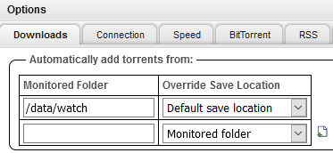

<p align="center"><a href="https://github.com/crazy-max/docker-qbittorrent" target="_blank"></a></p>

<p align="center">
  <a href="https://hub.docker.com/r/crazymax/qbittorrent/tags?page=1&ordering=last_updated"></a>
  <a href="https://github.com/crazy-max/docker-qbittorrent/actions?workflow=build"></a>
  <a href="https://hub.docker.com/r/crazymax/qbittorrent/"></a>
  <a href="https://hub.docker.com/r/crazymax/qbittorrent/"></a>
  <br /><a href="https://github.com/sponsors/crazy-max"></a>
  <a href="https://www.paypal.me/crazyws"></a>
</p>

## About

[qBittorrent](https://www.qbittorrent.org/) Docker image.

> **Note**
> 
> Want to be notified of new releases? Check out 🔔 [Diun (Docker Image Update Notifier)](https://github.com/crazy-max/diun)
> project!

___

* [Features](#features)
* [Build locally](#build-locally)
* [Image](#image)
* [Environment variables](#environment-variables)
* [Volumes](#volumes)
* [Ports](#ports)
* [Usage](#usage)
  * [Docker Compose](#docker-compose)
  * [Command line](#command-line)
* [Upgrade](#upgrade)
* [Notes](#notes)
  * [qBittorrent Web API](#qbittorrent-web-api)
  * [Change username and password](#change-username-and-password)
  * [Watch torrents](#watch-torrents)
* [Contributing](#contributing)
* [License](#license)

## Features

* Run as non-root user
* Multi-platform image
* Latest [qBittorrent](https://github.com/qbittorrent/qBittorrent) / [libtorrent-rasterbar](https://github.com/arvidn/libtorrent) release compiled from source
* WAN IP address automatically resolved for reporting to the tracker
* Finished torrents automatically saved to `/data/torrents`
* Handle [watch directory](#watch-torrents) from `/data/watch`
* Ability to use an [alternative WebUI](https://github.com/qbittorrent/qBittorrent/wiki/Alternate-WebUI-usage) in `/data/webui`
* Healthcheck through [qBittorrent API](https://github.com/qbittorrent/qBittorrent/wiki/Web-API-Documentation)
* Logs managed through a [dedicated container](examples/traefik/compose.yml)
* [Traefik](https://github.com/containous/traefik-library-image) as reverse proxy and creation/renewal of Let's Encrypt certificates (see [this template](examples/traefik))

## Build locally

```shell
git clone https://github.com/crazy-max/docker-qbittorrent.git
cd docker-qbittorrent

# Build image and output to docker (default)
docker buildx bake

# Build multi-platform image
docker buildx bake image-all
```

## Image

| Registry                                                                                         | Image                           |
|--------------------------------------------------------------------------------------------------|---------------------------------|
| [Docker Hub](https://hub.docker.com/r/crazymax/qbittorrent/)                                            | `crazymax/qbittorrent`                 |
| [GitHub Container Registry](https://github.com/users/crazy-max/packages/container/package/qbittorrent)  | `ghcr.io/crazy-max/qbittorrent`        |

Following platforms for this image are available:

```
$ docker run --rm mplatform/mquery crazymax/qbittorrent:latest
Image: crazymax/qbittorrent:latest
 * Manifest List: Yes
 * Supported platforms:
   - linux/amd64
   - linux/arm/v6
   - linux/arm/v7
   - linux/arm64
```

## Environment variables

* `TZ`: Timezone assigned to the container (default `UTC`)
* `PUID`: qBittorrent user id (default `1000`)
* `PGID`: qBittorrent group id (default `1000`)
* `WAN_IP`: Public IP address reported to the tracker (default auto resolved with `dig +short myip.opendns.com @resolver1.opendns.com`)
* `WEBUI_PORT`: WebUI port to be used (default `8080`)
* `ALT_WEBUI`: Enable alternative WebUI located in `/data/webui` (default `false`)

## Volumes

* `/data`: qBittorrent config, downloads, temp, torrents, watch, webui...

> :warning: Note that the volumes should be owned by the user/group with the specified `PUID` and `PGID`.
> If you don't give the volume correct permissions, the container may not start.

## Ports

* `6881`: DHT port
* `8080`: qBittorrent HTTP port

## Usage

### Docker Compose

Docker compose is the recommended way to run this image. You can use the following
[compose template](examples/compose/compose.yml), then run the container:

```bash
$ docker compose up -d
$ docker compose logs -f
```

### Command line

You can also use the following minimal command:

```bash
$ docker run -d --name qbittorrent \
  --ulimit nproc=65535 \
  --ulimit nofile=32000:40000 \
  -p 6881:6881/tcp \
  -p 6881:6881/udp \
  -p 8080:8080 \
  -v $(pwd)/data:/data \
  crazymax/qbittorrent:latest
```

## Upgrade

Recreate the container whenever I push an update:

```bash
docker compose pull
docker compose up -d
```

## Notes

### qBittorrent Web API

[qBittorrent Web API](https://github.com/qbittorrent/qBittorrent/wiki/Web-API-Documentation) can be used within
this image using curl.

```
$ docker compose exec qbittorrent curl --fail http://127.0.0.1:8080/api/v2/app/version
v4.1.8
```

### Change username and password

You can change the default username `admin` and password `adminadmin` through the API or WebUI.

```shell
docker compose exec qbittorrent curl --fail -X POST \
  -d 'json={"web_ui_username":"myuser","web_ui_password":"mypassword"}' \
  http://127.0.0.1:8080/api/v2/app/setPreferences
```

### Watch torrents

You can configure the monitored folders on the qBittorrent interface:



Or through the API:

```shell
docker compose exec qbittorrent curl --fail -X POST \
  -d 'json={"scan_dirs":{"/data/watch": 1}}' \
  http://127.0.0.1:8080/api/v2/app/setPreferences
```

## Contributing

Want to contribute? Awesome! The most basic way to show your support is to star the project, or to raise issues. You
can also support this project by [**becoming a sponsor on GitHub**](https://github.com/sponsors/crazy-max) or by making
a [Paypal donation](https://www.paypal.me/crazyws) to ensure this journey continues indefinitely!

Thanks again for your support, it is much appreciated! :pray:

## License

MIT. See `LICENSE` for more details.
